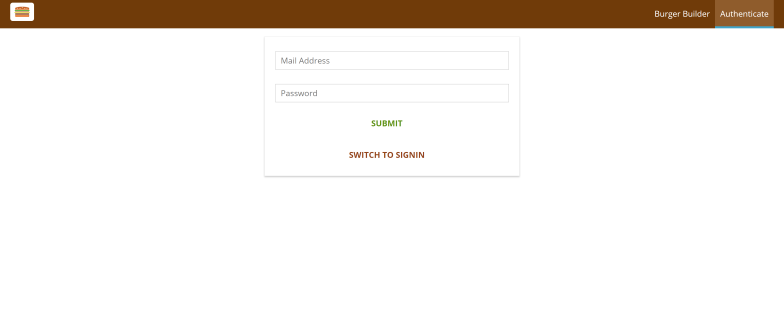
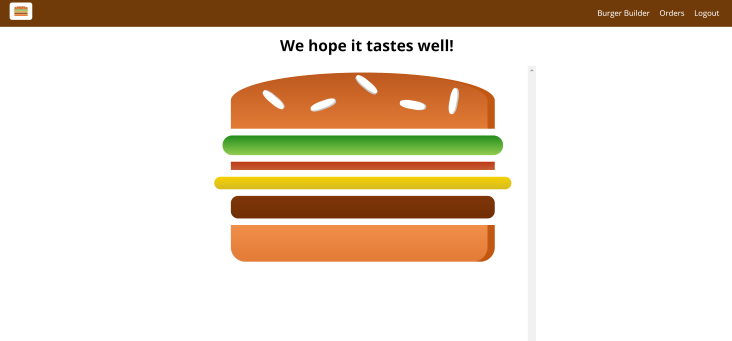
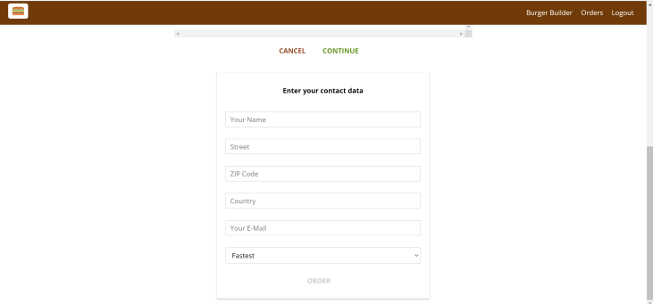
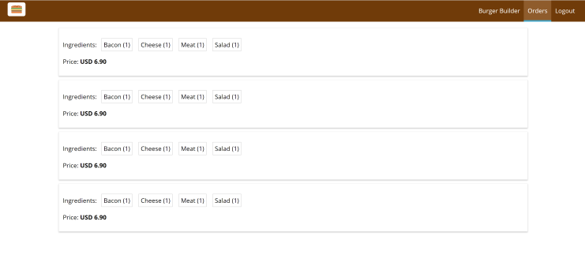

# Table Of Contents
  - [Introduction](#introduction)
  - [Technologies](#technologies)
  - [Installation](#installation)
  - [Screenshots](#screenshots)

## Introduction

Burger Builder Application for making and ordering burgers. This app was made with the help of the Udemy course [React - The Complete Guide](https://www.udemy.com/course/react-the-complete-guide-incl-redux/). 

## Technologies

* [Create React App](https://github.com/facebook/create-react-app) v17.0.1
* [Redux](https://github.com/reduxjs/redux) v4.0.5
* [React-Redux](https://github.com/reduxjs/react-redux) v7.2.2
* [Redux-Persist](https://github.com/rt2zz/redux-persist) v6.0.0
* [Redux-Thunk](https://github.com/reduxjs/redux-thunk) v2.3.0
* [Axios](https://github.com/axios/axios) v0.21.0
* [Firebase](https://firebase.google.com/)
* [Enzyme](https://github.com/enzymejs/enzyme) v3.11.0

## Installation

Use the package manager [npm](https://www.npmjs.com/) to install Burger-Builder-App.

```npm
git clone "https://github.com/yuvalitah/Burger-Builder-App.git"
cd ../path/to/the/file
npm install
```
To start the project
```npm
npm start
```

To run test
```npm
npm test
```

## Screenshots

### Authentication Page


### Burger Page


### Contact Data Page


### Orders Page

